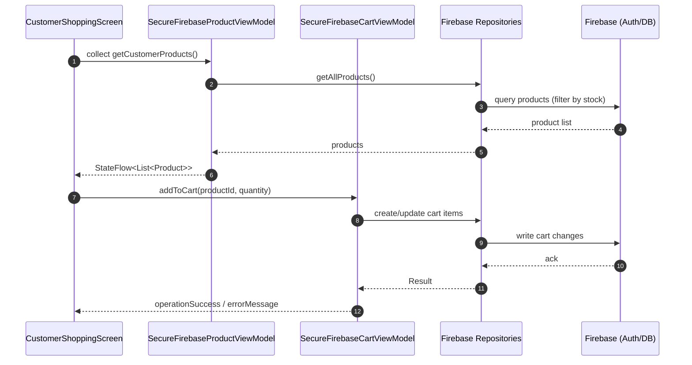
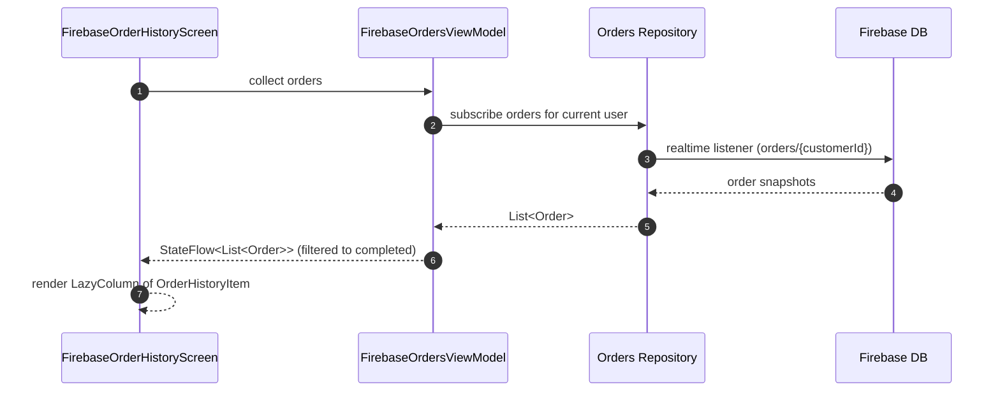
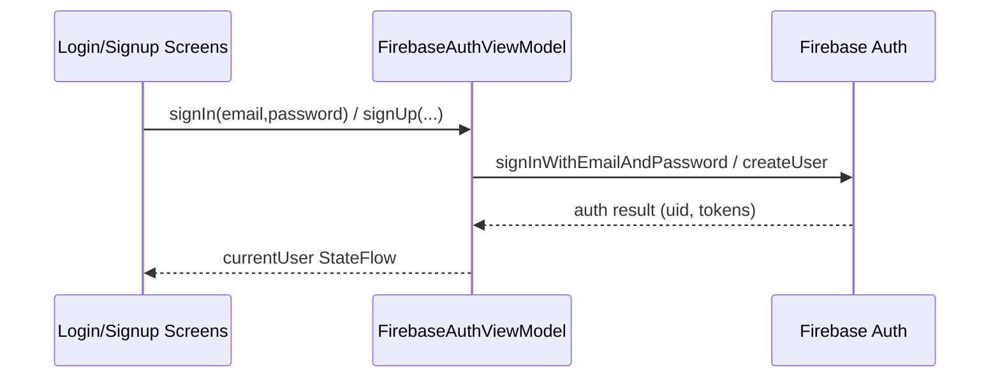
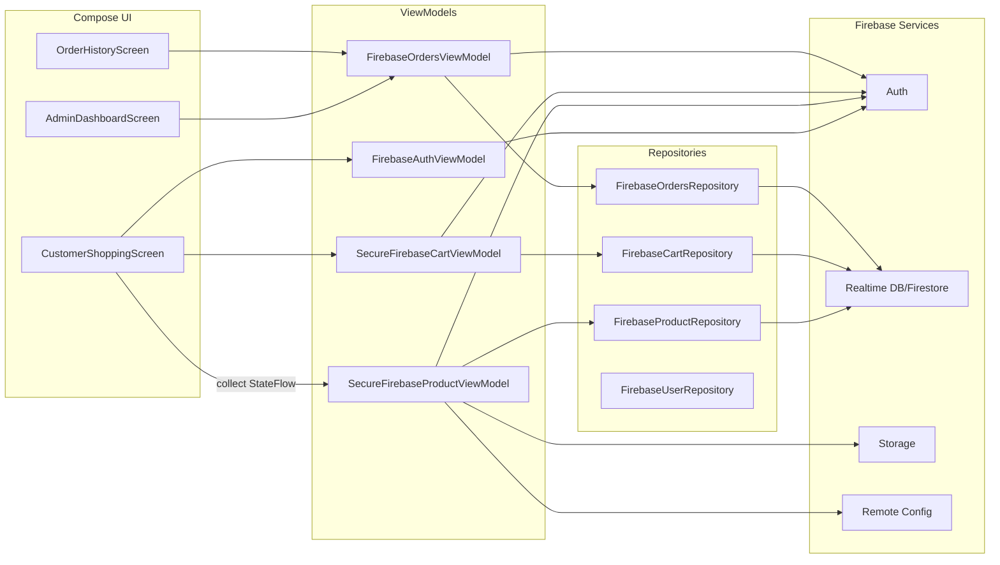
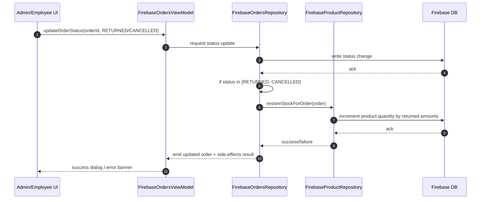

# LAZ Store – Graduation Project Dossier (Android, Jetpack Compose)

This document is a comprehensive, single-file reference for the LAZ Store Android app. It is structured as an academic dossier suitable for a graduation project: it includes an abstract, objectives, background, architecture (high- and low-level), sequence diagrams, implementation details with real code excerpts, development workflow, testing, security, and future work.


## 1) Abstract
LAZ Store is a role-based e-commerce application for Tesla parts built with Kotlin and Jetpack Compose. The app follows MVVM with unidirectional data flow, integrates Firebase (Auth, Realtime Database/Firestore, Storage, Remote Config), and provides Admin, Employee, and Customer experiences. This dossier documents the system architecture and key flows (shopping, cart, checkout, order history), shows implementation snippets, and explains build, testing, and security practices.


## 2) Objectives
- Provide a clean MVVM implementation using Kotlin + Jetpack Compose.
- Deliver role-based UX for Admin, Employee, and Customer.
- Persist and sync data via Firebase services with security rules.
- Showcase modern Compose UI patterns and reusable components.
- Offer maintainable architecture with clear separation of concerns.


## 3) Project Structure (selected)
```
src/main/kotlin/com/laz/
  FirebaseMainActivity.kt             # App entry, Compose host, VM wiring
  models/
    Product.kt                        # Domain model (id, name, qty, cost, price, imageUrl)
    Order.kt                          # Order, OrderItem, OrderStatus; toMap() for Firebase
    User.kt                           # User + UserRole (ADMIN, CUSTOMER, EMPLOYEE)
    ... (CartItem.kt, Return.kt, SupportChat.kt, etc.)
  ui/components/
    FloatingCartSummary.kt            # Draggable, animated cart FAB with total
    ProductImageDisplay.kt            # Image loader (Coil)
  ui/screens/
    CustomerShoppingScreen.kt         # Customer-only shopping/catalog
    FirebaseEnhancedCartScreen.kt     # Cart/checkout
    FirebaseOrderHistoryScreen.kt     # Order history listing
    AdminDashboardScreen.kt           # Admin analytics
    EmployeeProductManagementScreen.kt# Inventory management
    ... (Login/Signup/Profile/Tracking/AI Chat, etc.)
  viewmodels/
    SecureFirebaseProductViewModel.kt # Product permissions + flows
    SecureFirebaseCartViewModel.kt    # Cart flows + rules
    FirebaseOrdersViewModel.kt        # Orders realtime & filters
    FirebaseAuthViewModel.kt          # Auth + current user state
    FirebaseViewModelFactory.kt       # DI-style factory (FirebaseServices)
```


## 4) High-Level Architecture
The app uses a layered MVVM approach with unidirectional data flow.

```mermaid
flowchart LR
  subgraph Presentation [Presentation (Jetpack Compose)]
    Screens[Compose Screens] -->|observes StateFlow| VM[ViewModels]
    Components[Reusable Components] --> Screens
  end

  subgraph Domain [Domain Models]
    Product
    Order
    User
  end

  subgraph Data [Data / Repositories]
    Repo[Firebase Repositories]
  end

  subgraph Services [Firebase Services]
    Auth[Firebase Auth]
    DB[Realtime DB/Firestore]
    Storage[Firebase Storage]
    RC[Remote Config]
  end

  VM --> Repo --> DB
  VM --> Auth
  VM --> Storage
  VM --> RC
  Screens --> Components
  Domain <--> VM
```

Key principles:
- ViewModels expose immutable UI state via StateFlow.
- Screens observe state and send user intents to ViewModels.
- Repositories handle Firebase CRUD and mapping to domain models.
- Permission manager enforces role-based rules in ViewModels.


## 5) Low-Level Architecture (Product & Cart)
```mermaid
graph TD
  UI[CustomerShoppingScreen] -->|addToCart(productId, qty)| CartVM[SecureFirebaseCartViewModel]
  UI -->|getCustomerProducts()| ProductVM[SecureFirebaseProductViewModel]
  ProductVM --> RepoP[FirebaseProductRepository]
  CartVM --> RepoC[FirebaseCartRepository]
  RepoP --> DB[(Firebase DB)]
  RepoC --> DB
  CartVM --> Auth[FirebaseAuth]
  ProductVM --> Auth
  subgraph Security
    Perm[PermissionManager]
  end
  ProductVM --> Perm
  CartVM --> Perm
```


## 6) Core Sequence Diagrams

### 6.1 Customer Shopping & Add-to-Cart


### 6.2 Order History (Customer)


### 6.3 Authentication



## 7) Domain Models (code excerpts)

`src/main/kotlin/com/laz/models/Product.kt`:
```kotlin
@Entity(tableName = "products")
data class Product(
    @PrimaryKey(autoGenerate = true) val id: Long = 0,
    @ColumnInfo(name = "name") val name: String,
    @ColumnInfo(name = "quantity") val quantity: Int,
    @ColumnInfo(name = "cost") val cost: BigDecimal,
    @ColumnInfo(name = "price") val price: BigDecimal,
    @ColumnInfo(name = "shelf_location") val shelfLocation: String? = null,
    @ColumnInfo(name = "image_url") val imageUrl: String? = null
)
```

`src/main/kotlin/com/laz/models/Order.kt`:
```kotlin
data class Order(
    val id: Long = 0,
    val customerId: Long,
    val customerUsername: String,
    val items: List<OrderItem>,
    val totalAmount: BigDecimal,
    val status: OrderStatus,
    val paymentMethod: String,
    val shippingAddress: String,
    val orderDate: Long = System.currentTimeMillis(),
    val estimatedDelivery: Long? = null,
    val trackingNumber: String? = null,
    val notes: String? = null
)
```

`src/main/kotlin/com/laz/models/User.kt`:
```kotlin
@Entity(tableName = "users")
data class User(
    @PrimaryKey(autoGenerate = true) val id: Long = 0,
    @ColumnInfo(name = "username") val username: String,
    @ColumnInfo(name = "password") val password: String,
    @ColumnInfo(name = "role") val role: UserRole,
    @ColumnInfo(name = "email") val email: String? = null,
    @ColumnInfo(name = "phone_number") val phoneNumber: String? = null,
    @ColumnInfo(name = "address") val address: String? = null,
    @ColumnInfo(name = "created_at") val createdAt: Long = System.currentTimeMillis()
)
```


## 8) Entry Point and UI Composition (excerpt)

`src/main/kotlin/com/laz/FirebaseMainActivity.kt`:
```kotlin
class FirebaseMainActivity : ComponentActivity() {
  override fun onCreate(savedInstanceState: Bundle?) {
    super.onCreate(savedInstanceState)
    setContent {
      LazTheme {
        val authViewModel: FirebaseAuthViewModel = viewModel(
          factory = FirebaseServices.secureViewModelFactory
        )
        val defaultUser = User(
          id = 1L, username = "admin", password = "admin123",
          role = UserRole.ADMIN, email = "admin@laz.com"
        )
        FirebaseLazStoreApp(user = defaultUser, authViewModel = authViewModel)
      }
    }
  }
}
```


## 9) ViewModels and Permissions (excerpt)

`src/main/kotlin/com/laz/viewmodels/SecureFirebaseProductViewModel.kt`:
```kotlin
class SecureFirebaseProductViewModel(
  private val productRepository: FirebaseProductRepository,
  private val currentUser: StateFlow<User?>
) : ViewModel() {
  private val _products = MutableStateFlow<List<Product>>(emptyList())
  val products: StateFlow<List<Product>> = _products.asStateFlow()
  private val _permissionError = MutableStateFlow<String?>(null)
  val permissionError: StateFlow<String?> = _permissionError.asStateFlow()

  fun loadProducts() {
    val user = currentUser.value
    if (!PermissionManager.canViewProducts(user)) {
      _permissionError.value = "Access denied: You don't have permission to view products"
      return
    }
    viewModelScope.launch {
      val result = productRepository.getAllProducts()
      if (result.isSuccess) _products.value = result.getOrNull() ?: emptyList()
      else {/* set error */}
    }
  }

  fun getCustomerProducts(): StateFlow<List<Product>> =
    if (PermissionManager.isCustomer(currentUser.value))
      products.map { it.filter { p -> p.quantity > 0 } }
        .stateIn(viewModelScope, SharingStarted.Lazily, emptyList())
    else products
}
```


## 10) Key Screens and Components (excerpts)

`src/main/kotlin/com/laz/ui/screens/CustomerShoppingScreen.kt`:
```kotlin
@Composable
fun CustomerShoppingScreen(
  productViewModel: SecureFirebaseProductViewModel,
  cartViewModel: SecureFirebaseCartViewModel,
  onNavigateToCart: () -> Unit,
  onNavigateBack: () -> Unit
) {
  val products by productViewModel.getCustomerProducts().collectAsState()
  val cartItemCount by cartViewModel.cartItemCount.collectAsState()
  val cartTotal by cartViewModel.cartTotal.collectAsState()
  // ... UI with LazyColumn of CustomerProductCard and FloatingCartSummary
}
```

`src/main/kotlin/com/laz/ui/components/FloatingCartSummary.kt`:
```kotlin
@Composable
fun FloatingCartSummary(
  cartItemCount: Int,
  cartTotal: BigDecimal,
  isVisible: Boolean = true,
  onCartClick: () -> Unit,
  modifier: Modifier = Modifier
) {
  AnimatedVisibility(visible = isVisible && cartItemCount > 0) {
    Box(modifier = Modifier
      .offset { IntOffset(offsetX.roundToInt(), offsetY.roundToInt()) }
      .pointerInput(Unit) { detectDragGestures { change, drag -> /* update pos */ } }
    ) { /* Card with badge and total */ }
  }
}
```

`src/main/kotlin/com/laz/ui/screens/FirebaseOrderHistoryScreen.kt`:
```kotlin
@Composable
fun FirebaseOrderHistoryScreen(
  currentUser: User,
  onNavigateBack: () -> Unit,
  ordersViewModel: FirebaseOrdersViewModel = viewModel(factory = FirebaseServices.secureViewModelFactory)
) {
  val orders by ordersViewModel.orders.collectAsState()
  // Filter to current user's completed orders and render LazyColumn
}
```


## 11) Data Flow and State Management
- StateFlows in ViewModels provide reactive UI state.
- Compose screens subscribe using `collectAsState()`.
- Unidirectional flow: UI events -> ViewModel intents -> Repository I/O -> new state.
- Error and permission messages are tracked as `StateFlow<String?>` and rendered as banners/cards.


## 12) Firebase Integration
- Auth: FirebaseAuth manages login/signup and current user session.
- Database: Realtime Database/Firestore stores products, carts, orders.
- Storage: Product images and user uploads.
- Remote Config: Feature flags and thresholds (e.g., low-stock limit).
- Mapping: `Order.toMap()` converts to Firebase document-friendly structure.


## 13) Security & Roles
- Roles: `UserRole` = ADMIN, EMPLOYEE, CUSTOMER.
- Permission checks centralized in `PermissionManager` and enforced in ViewModels (e.g., `canAddProducts`, `canManageInventory`, `isCustomer`).
- UI gating: admin/employee-only actions hidden/disabled for customers.
- Firebase Rules: validate document paths by `auth.uid` and allowed operations per role.


## 14) Build, Run, and Config
- Android SDK: 34; Kotlin: 1.9.x; JDK: 17.
- Firebase setup: place `google-services.json` under app module; enable Auth, DB, Storage as needed.
- Gradle: use Firebase BoM to align versions; enable Compose.
- Run: select `FirebaseMainActivity` launch; device/emulator API 26+.


## 15) Testing & Quality
- Unit tests for ViewModels (business logic, permission checks).
- UI tests with Compose testing APIs for screen flows.
- Lint/ktlint and Detekt recommended for static analysis.
- Optional CI: GitHub Actions with Gradle build + test matrix.


## 16) Troubleshooting
- If products list is empty on first run, `SecureFirebaseProductViewModel` can seed sample products via `createSampleProductsForSetup()`.
- Check internet/Firebase configuration if Realtime listeners don’t update.
- Verify Firebase Rules and authenticated user role for permission errors.


## 17) Future Work
- Payment gateway integration.
- Push notifications for order status changes.
- Enhanced analytics dashboards and A/B tests via Remote Config.
- Offline cache with Room and paging.


## 18) References (in-repo)
- `src/main/kotlin/com/laz/FirebaseMainActivity.kt`
- `src/main/kotlin/com/laz/models/*`
- `src/main/kotlin/com/laz/ui/components/FloatingCartSummary.kt`
- `src/main/kotlin/com/laz/ui/screens/CustomerShoppingScreen.kt`
- `src/main/kotlin/com/laz/ui/screens/FirebaseOrderHistoryScreen.kt`
- `src/main/kotlin/com/laz/viewmodels/*`

This dossier consolidates the architecture, design, and implementation details of LAZ Store for academic review and future maintenance.


## 19) Permission Model (Policy Matrix)

- __ADMIN__
  - Products: Full CRUD, inventory adjustments.
  - Orders: Full lifecycle management (confirm, ship, deliver, cancel, return).
  - Users: Manage employees/customers where applicable.
  - Analytics: View dashboards and KPIs.
- __EMPLOYEE__
  - Products: View inventory; limited actions as allowed by policy (no destructive CRUD).
  - Orders: Update permissible statuses (e.g., processing, shipped, delivered) based on assignment.
  - Analytics: Restricted/summary view if enabled.
- __CUSTOMER__
  - Catalog: Browse in-stock products only.
  - Cart/Checkout: Add/remove/update quantities, place orders.
  - Orders: View own order history and tracking.

Enforcement: Centralized permission checks within ViewModels (e.g., `PermissionManager.canViewProducts`, `isCustomer`), and UI gating to hide/disable disallowed actions.


## 20) Data Layer Overview (Repositories & Services)

- __Repositories__: Abstract Firebase I/O for products, cart, orders, users.
  - Responsibilities: CRUD, realtime listeners, mapping to domain models, error handling.
- __ViewModel Factory__: `FirebaseServices.secureViewModelFactory` provides ViewModels with repository and `currentUser` wiring.
- __Realtime Mapping__: Orders utilize a `toMap()` pattern for Firebase serialization and consistent deserialization.
- __State__: ViewModels expose `StateFlow` for UI; repositories emit domain-safe results.


## 21) Critical Business Rules (Implemented)

- __Stock restoration on Returns/Cancellations__: When order status transitions to RETURNED or CANCELLED, product stock is restored accordingly (repository + ViewModel coordination).
- __Completed orders analytics__: Dashboard metrics count only SHIPPED/DELIVERED orders; CANCELLED/RETURNED excluded from revenue and totals.
- __Cart safeguards__:
  - Quantity zero auto-removal: If quantity drops to 0, item is removed from cart.
  - Five-minute stock hold: Items added to cart hold stock for 5 minutes with periodic cleanup and an option to extend.
- __Currency standardization__: All UI currency displays use JOD consistently.


## 22) Additional Screens and Modules (Overview)

- __AdminDashboardScreen__: KPIs, totals, recent activity; observes orders and analytics flows.
- __EmployeeProductManagementScreen__: Inventory browsing; role-gated actions with permission-aware UI and errors.
- __FirebaseReturnsProcessingScreen__: Process returns with clear success/error feedback and JOD formatting.
- __Payment/Checkout Screens__: Capture payment selection and show professional receipt dialog upon success.
- __Order Tracking / History__: Separate views for active tracking and completed history (delivered/returned/cancelled).
- __Support Chat / AI Assistant__: Customer support conversations persisted in Firebase with indexed rules.
- __Auth (Login/Signup/Profile)__: Firebase-backed authentication and profile management.


## 23) Firebase Rules and Config

- __Database Rules File__: `database.rules.json` (update in Firebase Console to match).
- __Support Collections (example rules snippet)__:
```json
"support_chats": {
  ".indexOn": ["customerId", "customerName", "timestamp", "isActive"],
  ".read": true,
  ".write": true
},
"support_messages": {
  ".indexOn": ["chatId", "senderId", "timestamp", "isFromCustomer"],
  ".read": true,
  ".write": true
}
```
- __Remote Config__: Use for feature flags (e.g., low-stock threshold) if enabled.
- __Storage__: Host product images; validate paths and MIME types via rules.


## 24) Build Stability and Environment Notes

- __Android Gradle Plugin__: 8.2.2 (stable)
- __Gradle Wrapper__: 8.2 (compatible)
- __Kotlin__: 1.9.x; __JDK__: 17; __Android SDK__: 34
- __Firebase BoM__: align dependencies via platform BoM (e.g., 31.x series)
- __Testing Config__: `testOptions { unitTests { isIncludeAndroidResources = true } }`
- __Run Target__: API 26+ emulator/device; ensure `google-services.json` present.


---

This document is final and suitable for supervisor submission. It covers architecture, flows, security, repositories, critical business rules, environment, and references with real code excerpts.


## 25) Extra Diagrams

### 25.1 Repository / Data Flow Overview


### 25.2 Returns Workflow & Stock Restoration


### 25.3 Role Permissions Overview (Simple)

```mermaid
flowchart TB
  ADMIN[ADMIN] --> ProductsCRUD[Products: CRUD + Inventory]
  ADMIN --> OrdersFull[Orders: Full Lifecycle]
  ADMIN --> UsersManage[Users: Manage]
  ADMIN --> AnalyticsView[Analytics: Full]

  EMPLOYEE[EMPLOYEE] --> ProductsView[Products: View]
  EMPLOYEE --> OrdersUpdate[Orders: Update Allowed Statuses]
  EMPLOYEE --> AnalyticsLite[Analytics: Limited]

  CUSTOMER[CUSTOMER] --> BrowseCatalog[Catalog: Browse In-Stock]
  CUSTOMER --> CartCheckout[Cart: Add/Update/Checkout]
  CUSTOMER --> ViewOrders[Orders: Own History/Tracking]

  classDef admin fill:#1f77b4,stroke:#0d3b66,stroke-width:1,color:#fff;
  classDef employee fill:#2ca02c,stroke:#145214,stroke-width:1,color:#fff;
  classDef customer fill:#ff7f0e,stroke:#a34a00,stroke-width:1,color:#fff;

  class ADMIN admin;
  class EMPLOYEE employee;
  class CUSTOMER customer;
```

